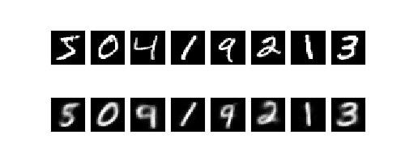
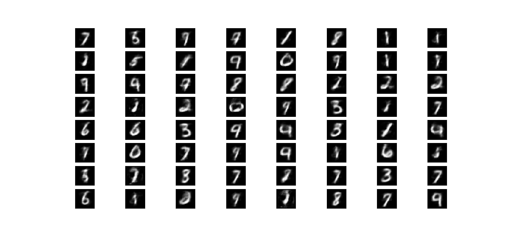
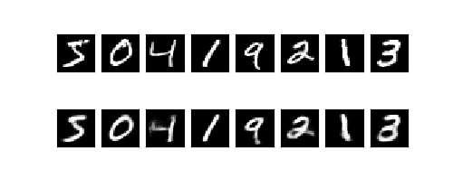
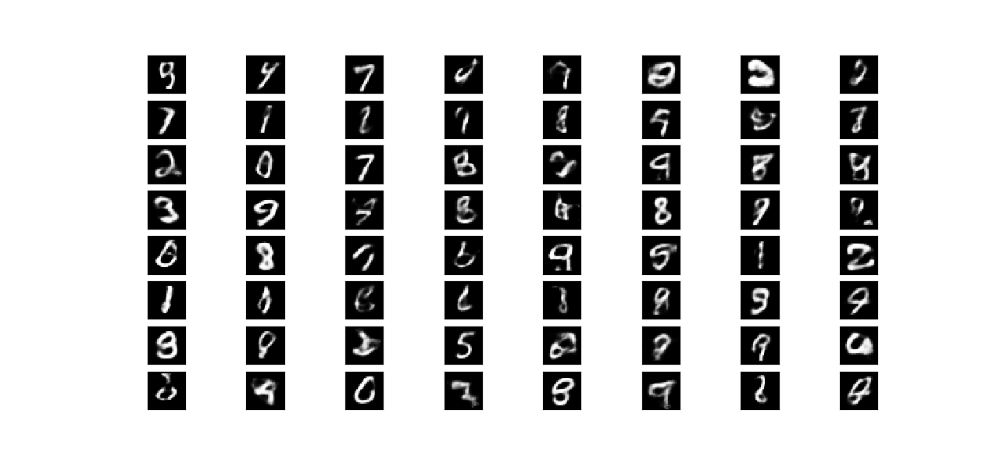

# 用AutoEncoder生成MNIST图片

使用AutoEncoders来生成MNIST数据集中的图片

## basic.py

- 原始版的AutoEncoder

- 用对称的神经网络作为encoder和decoder，bottleneck部分设计为3个神经元

- 实验结果

  ```python
  Epoch:  1 	Training Loss: 0.000034
  Epoch:  2 	Training Loss: 0.000031
  Epoch:  3 	Training Loss: 0.000026
  Epoch:  4 	Training Loss: 0.000024
  Epoch:  5 	Training Loss: 0.000022
  Epoch:  6 	Training Loss: 0.000021
  Epoch:  7 	Training Loss: 0.000020
  Epoch:  8 	Training Loss: 0.000020
  Epoch:  9 	Training Loss: 0.000020
  Epoch:  10 	Training Loss: 0.000019
  ```

  
  
- 将随机产生的编码输入decoder生成新的图片

  


## vae.py

- Variational Autoencoder

- 通过学习mean和variance，再与N(0,1) Gaussian组合得到带噪音的编码

- 实验结果（和basic.py相比，对原数据编码再解码的还原度更高）

  ```python
  Epoch:  1 	Training Loss: 2.234251
  Epoch:  2 	Training Loss: 2.034710
  Epoch:  3 	Training Loss: 1.984654
  Epoch:  4 	Training Loss: 1.922650
  Epoch:  5 	Training Loss: 1.923176
  Epoch:  6 	Training Loss: 1.935340
  Epoch:  7 	Training Loss: 1.892133
  Epoch:  8 	Training Loss: 1.903651
  Epoch:  9 	Training Loss: 1.902728
  Epoch:  10 	Training Loss: 1.873164
  ```

  

- 将随机产生的编码输入decoder生成新的图片 

  

- P.S. 事实上，我在Google上搜索AutoEncoder的相关文献时搜到的主要都是VAE还有其与GAN结合的变体等等，最原初的AutoEncoder的paper我甚至没有找到。不过囿于前置知识和时间，我还没有把关于KL散度的推导以及一系列数学证明完全看明白，所以这里只是套公式简单实现了一下算法，希望以后能补上。
